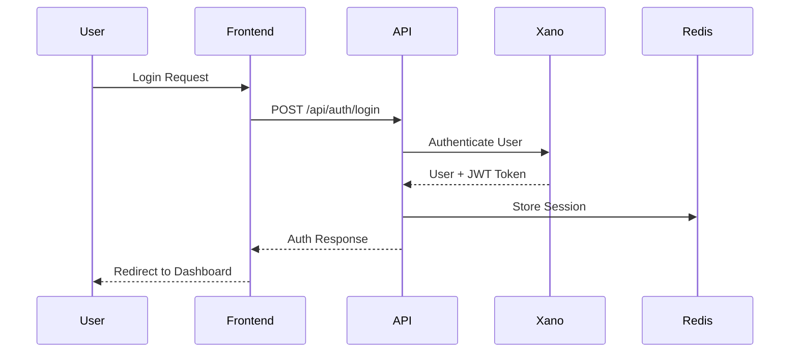
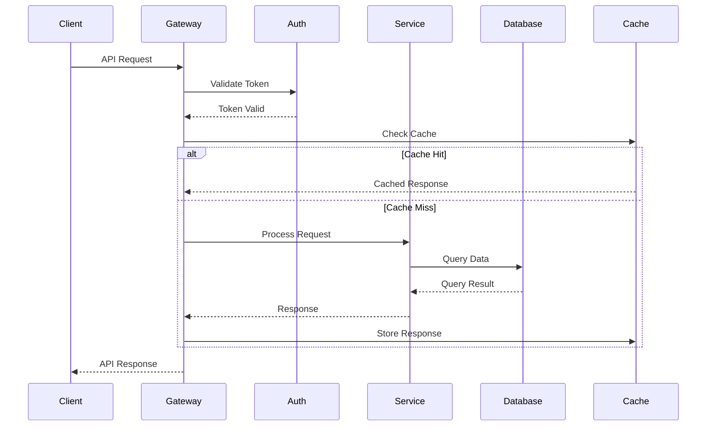
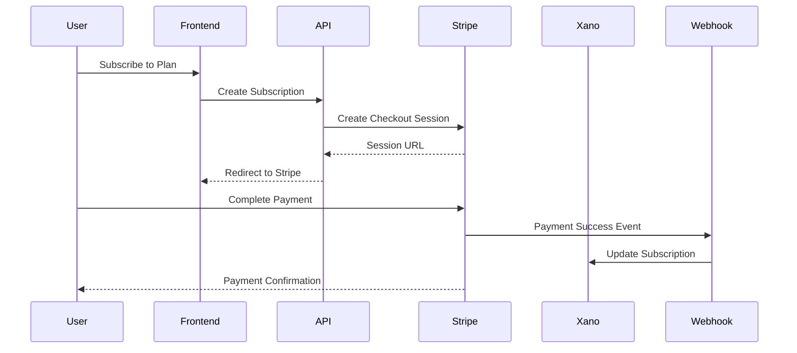

# System Architecture Overview

## Executive Summary

The SaaS template implements a modern, cloud-native architecture designed for enterprise-scale deployment. The system follows a layered architecture pattern with clear separation of concerns, enabling scalability, maintainability, and security.

## High-Level Architecture

```mermaid
graph TB
    subgraph "Client Layer"
        Web[Web Application<br/>Next.js + React]
        Mobile[Mobile App<br/>(Future)]
        API_Client[API Clients<br/>Third-party]
    end

    subgraph "API Gateway Layer"
        Gateway[API Gateway<br/>Next.js API Routes]
        Auth[Authentication<br/>NextAuth + JWT]
        RateLimit[Rate Limiting]
    end

    subgraph "Application Layer"
        App[Application Logic<br/>Next.js Server Components]
        Business[Business Logic<br/>Service Layer]
        Integration[Integration Layer<br/>Xano Client]
    end

    subgraph "Data Layer"
        Xano[(Xano Backend<br/>PostgreSQL)]
        Redis[(Redis Cache<br/>Sessions & Cache)]
        Files[File Storage<br/>S3/Cloudinary]
    end

    subgraph "External Services"
        Stripe[Stripe<br/>Payments]
        Maps[Maps API<br/>Google/Mapbox]
        Email[Email Service<br/>SendGrid/Resend]
        Analytics[Analytics<br/>PostHog/Sentry]
    end

    Web --> Gateway
    Mobile --> Gateway
    API_Client --> Gateway

    Gateway --> Auth
    Gateway --> RateLimit
    Gateway --> App

    App --> Business
    Business --> Integration
    Integration --> Xano
    Integration --> Redis
    Integration --> Files

    Business --> Stripe
    Business --> Maps
    Business --> Email
    Business --> Analytics
```

## Core Components

### 1. Presentation Layer

**Next.js Frontend Application**
- **Server-Side Rendering (SSR)**: Improved SEO and initial load performance
- **Static Site Generation (SSG)**: Pre-rendered pages for optimal performance
- **Client-Side Rendering (CSR)**: Dynamic interactions and real-time updates
- **Progressive Web App (PWA)**: Offline capabilities and mobile-first design

**Key Features:**
- Responsive design with mobile-first approach
- Dark/light theme support
- Real-time notifications
- Offline functionality
- Accessibility (WCAG 2.1 AA compliant)

### 2. API Gateway Layer

**Next.js API Routes**
- **Unified API Endpoint**: Single entry point for all API requests
- **Request Routing**: Intelligent routing to appropriate services
- **Authentication**: JWT-based authentication with refresh tokens
- **Authorization**: Role-based access control (RBAC)
- **Rate Limiting**: Configurable rate limiting per user/endpoint
- **Input Validation**: Schema-based request validation
- **Error Handling**: Standardized error responses
- **Logging**: Comprehensive request/response logging

### 3. Application Layer

**Business Logic Services**
- **User Management**: User registration, authentication, profile management
- **Subscription Management**: Plan management, billing, usage tracking
- **Project Management**: Multi-tenant project and team management
- **Notification System**: Real-time and email notifications
- **Analytics Service**: Event tracking and business metrics
- **Integration Service**: Third-party service integrations

### 4. Data Layer

**Xano Backend**
- **PostgreSQL Database**: Primary data storage with ACID compliance
- **Auto-generated APIs**: RESTful APIs generated from database schema
- **Authentication System**: Built-in JWT authentication
- **File Upload**: Integrated file storage and management
- **Database Migrations**: Version-controlled schema changes

**Redis Cache**
- **Session Storage**: User session management
- **API Response Caching**: Improved API performance
- **Rate Limiting Data**: Request throttling information
- **Real-time Data**: WebSocket connection management

## System Qualities

### Performance Characteristics

| Metric | Target | Measurement |
|--------|---------|-------------|
| API Response Time | < 200ms (95th percentile) | Response time monitoring |
| Page Load Time | < 2 seconds | Core Web Vitals |
| Database Query Time | < 100ms (average) | Database monitoring |
| Cache Hit Rate | > 80% | Redis monitoring |
| Concurrent Users | 10,000+ | Load testing |
| Throughput | 1,000+ requests/second | Performance testing |

### Scalability Strategy

**Horizontal Scaling:**
- Stateless application servers
- Load balancer distribution
- Database read replicas
- CDN for static assets
- Redis cluster for caching

**Vertical Scaling:**
- CPU and memory optimization
- Database performance tuning
- Query optimization
- Connection pooling
- Resource monitoring

### Security Architecture

**Defense in Depth:**
1. **Edge Security**: CDN-based DDoS protection
2. **Network Security**: VPC and security groups
3. **Application Security**: Input validation and sanitization
4. **Data Security**: Encryption at rest and in transit
5. **Access Control**: Multi-factor authentication and RBAC

**Security Controls:**
- Web Application Firewall (WAF)
- SSL/TLS encryption (TLS 1.3)
- JWT token authentication
- SQL injection prevention
- XSS protection headers
- CSRF protection
- Security headers (HSTS, CSP, etc.)

## Data Flow Architecture

### User Authentication Flow


### API Request Flow


### Payment Processing Flow


## Integration Architecture

### Third-Party Services

**Payment Processing (Stripe)**
- Subscription management
- One-time payments
- Webhook event handling
- Invoice generation
- Tax calculation

**Maps Integration (Google Maps/Mapbox)**
- Location services
- Geocoding/reverse geocoding
- Route optimization
- Interactive maps
- Place search

**Email Services (SendGrid/Resend)**
- Transactional emails
- Marketing emails
- Email templates
- Delivery tracking
- Bounce handling

**Analytics & Monitoring**
- PostHog: Product analytics and feature flags
- Sentry: Error tracking and performance monitoring
- Vercel Analytics: Web performance metrics

### Enterprise Integrations

**Single Sign-On (SSO)**
- SAML 2.0 support
- OAuth 2.0/OpenID Connect
- Active Directory integration
- Custom identity providers

**Data Integration**
- REST API endpoints
- Webhook subscriptions
- CSV import/export
- Real-time data sync
- ETL pipeline support

## Deployment Architecture

### Container Strategy
```dockerfile
# Multi-stage Docker build
FROM node:18-alpine AS builder
# Build stage for optimized production image
FROM node:18-alpine AS runner
# Production runtime with minimal footprint
```

**Deployment Options:**
1. **Vercel (Recommended)**: Serverless deployment with global CDN
2. **Docker Containers**: Self-hosted with Docker Compose or Kubernetes
3. **Cloud Platforms**: AWS ECS, Google Cloud Run, Azure Container Instances

### Environment Strategy

| Environment | Purpose | Configuration |
|-------------|---------|---------------|
| Development | Local development and testing | Hot reload, debug mode, test data |
| Staging | Pre-production testing | Production-like data, monitoring |
| Production | Live system | Optimized performance, monitoring, backups |

## Monitoring & Observability

### Application Monitoring
- **Performance Metrics**: Response time, throughput, error rates
- **Business Metrics**: User signups, subscription conversions, feature usage
- **Infrastructure Metrics**: CPU, memory, disk, network utilization
- **Security Metrics**: Failed login attempts, rate limit violations

### Logging Strategy
- **Structured Logging**: JSON format with consistent fields
- **Log Levels**: ERROR, WARN, INFO, DEBUG with appropriate filtering
- **Log Aggregation**: Centralized logging with search and alerting
- **Audit Logging**: Comprehensive audit trail for compliance

### Error Tracking
- **Automatic Error Capture**: Uncaught exceptions and promise rejections
- **Performance Monitoring**: Slow queries and performance bottlenecks
- **User Impact**: Error impact on user experience and business metrics
- **Alert Configuration**: Real-time alerts for critical errors

## Future Architecture Considerations

### Microservices Migration Path
1. **Service Identification**: Extract bounded contexts
2. **API Design**: Define service interfaces
3. **Data Separation**: Separate databases per service
4. **Communication**: Implement service mesh
5. **Deployment**: Container orchestration with Kubernetes

### Event-Driven Architecture
1. **Event Sourcing**: Capture state changes as events
2. **CQRS**: Separate read and write models
3. **Event Streaming**: Apache Kafka or similar
4. **Saga Pattern**: Distributed transaction management

### Machine Learning Integration
1. **Data Pipeline**: ETL for ML training data
2. **Model Serving**: RESTful ML prediction APIs
3. **A/B Testing**: Feature flag integration
4. **Analytics**: ML-driven insights and recommendations

---

*This system overview provides the foundation for understanding the SaaS template's architecture and serves as a guide for enterprise implementation and scaling.*