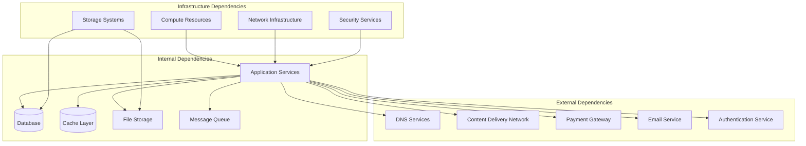

# Business Continuity Documentation

Comprehensive business continuity and disaster recovery documentation for enterprise resilience and risk management.

## Business Continuity Overview

Business continuity planning ensures the organization can continue operating during and after disruptive events. This documentation provides frameworks, procedures, and tools necessary for maintaining service availability and data integrity in the face of various threats and disruptions.

### Business Continuity Principles
- **Risk Assessment**: Identify and assess potential threats and vulnerabilities
- **Business Impact Analysis**: Understand the impact of disruptions on business operations
- **Recovery Strategies**: Develop multiple recovery options for different scenarios
- **Testing and Maintenance**: Regular testing and updating of continuity plans
- **Communication**: Clear communication during incidents and recovery
- **Continuous Improvement**: Learn from incidents and improve plans

## Business Continuity Documentation Structure

### 📋 Planning and Strategy
- **[Business Continuity Plan](./business-continuity-plan.md)** - Comprehensive continuity strategy
- **[Business Impact Analysis](./business-impact-analysis.md)** - Critical business function analysis
- **[Risk Assessment](./risk-assessment.md)** - Threat identification and risk evaluation
- **[Recovery Strategies](./recovery-strategies.md)** - Multiple recovery approach options
- **[Crisis Management](./crisis-management.md)** - Crisis response and decision-making

### 🛡️ Disaster Recovery
- **[Disaster Recovery Plan](./disaster-recovery-plan.md)** - Technical recovery procedures
- **[Data Backup Strategy](./data-backup-strategy.md)** - Comprehensive backup and restoration
- **[Infrastructure Recovery](./infrastructure-recovery.md)** - System and network recovery
- **[Application Recovery](./application-recovery.md)** - Service restoration procedures
- **[Recovery Testing](./recovery-testing.md)** - Regular testing and validation

### 📞 Communication and Coordination
- **[Emergency Communication Plan](./emergency-communication-plan.md)** - Stakeholder communication
- **[Incident Command Structure](./incident-command-structure.md)** - Leadership and coordination
- **[Customer Communication](./customer-communication.md)** - External communication strategy
- **[Media Relations](./media-relations.md)** - Public relations and media handling
- **[Legal and Regulatory](./legal-regulatory.md)** - Compliance and legal obligations

### 👥 People and Resources
- **[Employee Safety](./employee-safety.md)** - Staff safety and welfare procedures
- **[Remote Work Procedures](./remote-work-procedures.md)** - Distributed workforce management
- **[Vendor Management](./vendor-management.md)** - Third-party service continuity
- **[Resource Allocation](./resource-allocation.md)** - Critical resource management
- **[Training and Awareness](./training-awareness.md)** - Staff preparedness programs

### 📊 Testing and Improvement
- **[Testing Framework](./testing-framework.md)** - Comprehensive testing methodology
- **[Exercise Planning](./exercise-planning.md)** - Simulation and drill procedures
- **[Performance Metrics](./performance-metrics.md)** - Continuity effectiveness measures
- **[Lessons Learned](./lessons-learned.md)** - Post-incident improvement process
- **[Plan Maintenance](./plan-maintenance.md)** - Regular plan updates and reviews

## Business Impact Analysis

### Critical Business Functions

| Function | Impact Level | Maximum Tolerable Downtime | Recovery Priority |
|----------|--------------|---------------------------|-------------------|
| Customer Authentication | Critical | 5 minutes | P1 |
| Payment Processing | Critical | 15 minutes | P1 |
| Core API Services | Critical | 15 minutes | P1 |
| Customer Support | High | 2 hours | P2 |
| Reporting/Analytics | Medium | 8 hours | P3 |
| Marketing Website | Low | 24 hours | P4 |

### Financial Impact Assessment

| Downtime Duration | Revenue Impact | Customer Impact | Reputation Impact |
|-------------------|----------------|----------------|-------------------|
| 0-15 minutes | Minimal | Low | None |
| 15-60 minutes | Low | Medium | Low |
| 1-4 hours | Medium | High | Medium |
| 4-24 hours | High | Very High | High |
| 24+ hours | Severe | Critical | Severe |

### Dependencies Analysis



## Recovery Time and Point Objectives

### Service-Level Recovery Targets

| Service | RTO (Recovery Time Objective) | RPO (Recovery Point Objective) | Justification |
|---------|------------------------------|--------------------------------|---------------|
| Web Application | 15 minutes | 5 minutes | Customer-facing service |
| API Services | 10 minutes | 1 minute | Critical business functions |
| Database | 30 minutes | 1 minute | Data integrity requirements |
| File Storage | 1 hour | 15 minutes | Non-critical for immediate operations |
| Analytics | 4 hours | 1 hour | Business intelligence needs |

### Recovery Strategies by Service

#### Application Services
- **Primary**: Auto-scaling with health checks
- **Secondary**: Multi-region deployment
- **Tertiary**: Manual failover to backup infrastructure

#### Database Services
- **Primary**: Automated failover with read replicas
- **Secondary**: Point-in-time recovery from backups
- **Tertiary**: Manual restoration from archived backups

#### File Storage
- **Primary**: Multi-region replication
- **Secondary**: Backup restoration
- **Tertiary**: Manual data recovery

## Disaster Scenarios and Response Plans

### Scenario 1: Data Center Outage
**Impact**: Complete service unavailability
**Probability**: Low
**Recovery Strategy**:
1. Activate backup data center
2. Update DNS to point to backup infrastructure
3. Restore services from backups
4. Communicate with stakeholders

**Recovery Steps**:
```bash
# Immediate Response (0-15 minutes)
1. Confirm outage and assess scope
2. Activate incident command center
3. Notify key stakeholders
4. Begin failover procedures

# Short-term Recovery (15 minutes - 2 hours)
5. Activate backup infrastructure
6. Restore critical services
7. Update DNS and routing
8. Verify service functionality

# Full Recovery (2-8 hours)
9. Restore all services
10. Verify data integrity
11. Resume normal operations
12. Conduct post-incident review
```

### Scenario 2: Cyberattack/Ransomware
**Impact**: Data compromise and service disruption
**Probability**: Medium
**Recovery Strategy**:
1. Isolate affected systems
2. Activate incident response team
3. Restore from clean backups
4. Implement additional security measures

### Scenario 3: Key Personnel Unavailability
**Impact**: Reduced operational capability
**Probability**: High
**Recovery Strategy**:
1. Activate cross-training procedures
2. Engage backup personnel
3. Utilize vendor support
4. Implement emergency procedures

### Scenario 4: Third-Party Service Failure
**Impact**: Dependent service unavailability
**Probability**: Medium
**Recovery Strategy**:
1. Switch to backup service providers
2. Implement degraded service mode
3. Communicate service limitations
4. Monitor service restoration

## Communication Plan

### Internal Communication Structure

| Role | Responsibility | Contact Method | Escalation Time |
|------|----------------|----------------|-----------------|
| Incident Commander | Overall response coordination | Phone, Slack | Immediate |
| Technical Lead | Technical response | Phone, Slack | 5 minutes |
| Communications Lead | Stakeholder communication | Email, Slack | 10 minutes |
| Executive Sponsor | Strategic decisions | Phone | 15 minutes |

### External Communication Templates

#### Customer Communication - Service Disruption
```
Subject: [URGENT] Service Disruption - We're Working on a Fix

Dear [Customer Name],

We are currently experiencing a service disruption affecting [specific services].
Our team is actively working to resolve this issue.

Current Status: [Brief description]
Estimated Resolution: [Time estimate]
Next Update: [When you'll provide next update]

We sincerely apologize for any inconvenience and will keep you updated
as we work to restore normal service.

Best regards,
[Company] Support Team

Status Page: [URL]
Support: [Contact information]
```

#### Media Statement Template
```
[Company] is currently experiencing a technical issue affecting some of our services.
Our engineering team is working diligently to resolve the matter and restore full
functionality. We are committed to transparency and will provide updates as more
information becomes available. Customer data security and privacy remain our top priority.

For real-time updates, please visit our status page at [URL].
```

## Recovery Procedures

### Database Recovery Procedures
```sql
-- Point-in-time recovery example
-- 1. Stop application connections
-- 2. Create recovery database
CREATE DATABASE recovery_db WITH TEMPLATE template0;

-- 3. Restore from backup
pg_restore -d recovery_db /path/to/backup/file.dump

-- 4. Apply point-in-time recovery
SELECT pg_start_backup('recovery');
-- Restore WAL files
SELECT pg_stop_backup();

-- 5. Verify data integrity
SELECT count(*) FROM critical_table;

-- 6. Switch to recovered database
-- Update application configuration
-- Resume operations
```

### Application Recovery Procedures
```bash
#!/bin/bash
# Application recovery script

# 1. Verify infrastructure availability
curl -f http://database-server:5432 || exit 1
curl -f http://cache-server:6379 || exit 1

# 2. Deploy application
docker-compose -f docker-compose.prod.yml up -d

# 3. Run health checks
for i in {1..30}; do
    if curl -f http://localhost:3000/api/health; then
        echo "Application is healthy"
        break
    fi
    sleep 10
done

# 4. Verify critical functions
curl -f http://localhost:3000/api/auth/health
curl -f http://localhost:3000/api/payments/health

# 5. Enable traffic
# Update load balancer configuration
# Remove maintenance mode
```

## Testing and Exercises

### Testing Schedule

| Test Type | Frequency | Scope | Duration |
|-----------|-----------|-------|----------|
| Tabletop Exercises | Quarterly | Full plan review | 2 hours |
| Technical Recovery Tests | Monthly | System components | 4 hours |
| Full DR Simulation | Annually | Complete failover | 8 hours |
| Communication Tests | Bi-weekly | Notification systems | 30 minutes |

### Testing Scenarios

#### Quarterly Tabletop Exercise
**Objective**: Test decision-making and communication
**Participants**: Leadership team, key technical staff
**Scenario**: Major service outage during peak hours
**Outcomes**: Updated procedures, improved communication

#### Monthly Technical Test
**Objective**: Verify technical recovery procedures
**Participants**: Technical team
**Scenario**: Database failover and application recovery
**Outcomes**: Procedure refinement, tool improvements

#### Annual DR Simulation
**Objective**: Complete disaster recovery validation
**Participants**: Full incident response team
**Scenario**: Complete data center failure
**Outcomes**: Plan updates, training improvements

## Metrics and KPIs

### Recovery Performance Metrics

| Metric | Target | Measurement Method |
|--------|--------|-------------------|
| Mean Time to Recovery (MTTR) | < 1 hour | Incident tracking system |
| Recovery Time Objective Achievement | 95% | Automated monitoring |
| Data Loss (RPO Achievement) | 99% | Backup verification |
| Communication Time | < 15 minutes | Incident logs |
| Customer Satisfaction Post-Incident | > 80% | Customer surveys |

### Business Continuity Maturity Metrics

| Area | Current Level | Target Level | Gap Analysis |
|------|---------------|--------------|--------------|
| Plan Documentation | 4/5 | 5/5 | Annual review needed |
| Testing Coverage | 3/5 | 4/5 | Increase test frequency |
| Staff Training | 3/5 | 4/5 | Enhanced training program |
| Technology Resilience | 4/5 | 5/5 | Implement chaos engineering |
| Recovery Capabilities | 4/5 | 4/5 | Maintain current level |

## Vendor and Third-Party Management

### Critical Vendor Assessment

| Vendor | Service | Criticality | Backup Option | Contract Terms |
|--------|---------|-------------|---------------|----------------|
| Cloud Provider | Infrastructure | Critical | Multi-cloud | 99.99% SLA |
| Database Service | Data storage | Critical | Self-hosted | 99.9% SLA |
| Payment Processor | Payments | Critical | Secondary processor | 99.5% SLA |
| Email Service | Communications | High | Alternative provider | 99% SLA |
| CDN Provider | Content delivery | Medium | Multiple CDNs | 99% SLA |

### Vendor Contingency Plans
1. **Primary Vendor Unavailable**: Activate secondary vendor within 1 hour
2. **Vendor Bankruptcy**: Transfer services to backup vendor within 72 hours
3. **Vendor Security Breach**: Assess impact and implement additional controls
4. **Contract Disputes**: Maintain service while resolving legal issues

## Compliance and Legal Considerations

### Regulatory Requirements
- **Data Protection**: GDPR, CCPA compliance during incidents
- **Financial Services**: SOX reporting requirements
- **Healthcare**: HIPAA breach notification if applicable
- **Industry Standards**: ISO 22301 business continuity compliance

### Legal Obligations
- **Customer Notifications**: SLA-defined notification requirements
- **Regulatory Reporting**: Incident reporting to regulators
- **Insurance Claims**: Documentation for business interruption claims
- **Contract Compliance**: Meeting vendor and customer SLAs

## Continuous Improvement

### Plan Maintenance Schedule
- **Monthly**: Update contact information and vendor details
- **Quarterly**: Review and test communication procedures
- **Semi-annually**: Conduct business impact analysis review
- **Annually**: Complete plan review and major updates

### Improvement Process
1. **Post-Incident Analysis**: Document lessons learned
2. **Plan Updates**: Incorporate improvements
3. **Training Updates**: Update staff training materials
4. **Testing Enhancements**: Improve testing scenarios
5. **Technology Improvements**: Implement better tools and processes

---

*This business continuity documentation provides comprehensive guidance for maintaining business operations during disruptions and ensuring rapid recovery from various disaster scenarios.*