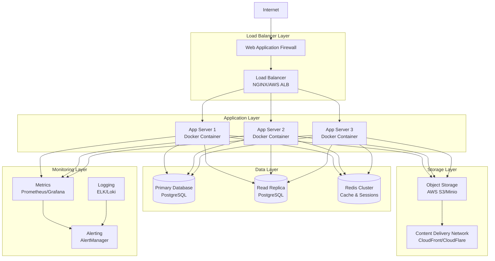

# Operations Documentation

Comprehensive operational documentation for enterprise deployment, monitoring, and maintenance of the SaaS template.

## Operations Overview

This documentation provides enterprise-grade operational procedures, runbooks, and best practices for deploying, monitoring, and maintaining the SaaS template in production environments.

### Operations Principles
- **Reliability First**: System availability and data integrity are paramount
- **Automation**: Automate repetitive tasks and reduce human error
- **Observability**: Comprehensive monitoring and alerting
- **Scalability**: Design for growth and performance
- **Security**: Security considerations in all operational procedures
- **Documentation**: Keep procedures current and accessible

## Operations Documentation Structure

### 🚀 Deployment & Infrastructure
- **[Deployment Guide](./deployment-guide.md)** - Complete deployment procedures
- **[Infrastructure Setup](./infrastructure-setup.md)** - Cloud infrastructure provisioning
- **[Environment Management](./environment-management.md)** - Multi-environment configuration
- **[Container Orchestration](./container-orchestration.md)** - Docker and Kubernetes management
- **[Load Balancing](./load-balancing.md)** - Traffic distribution and failover

### 📊 Monitoring & Alerting
- **[Monitoring Setup](./monitoring-setup.md)** - Comprehensive monitoring implementation
- **[Performance Monitoring](./performance-monitoring.md)** - Application performance management
- **[Infrastructure Monitoring](./infrastructure-monitoring.md)** - System resource monitoring
- **[Log Management](./log-management.md)** - Centralized logging and analysis
- **[Alerting Configuration](./alerting-configuration.md)** - Alert rules and escalation

### 🔧 Maintenance & Support
- **[Maintenance Procedures](./maintenance-procedures.md)** - Regular maintenance tasks
- **[Database Administration](./database-administration.md)** - Database management and optimization
- **[Backup & Recovery](./backup-recovery.md)** - Data protection and recovery procedures
- **[Performance Tuning](./performance-tuning.md)** - System optimization guidelines
- **[Capacity Planning](./capacity-planning.md)** - Resource planning and scaling

### 🚨 Incident Management
- **[Incident Response](./incident-response.md)** - Incident handling procedures
- **[Runbooks](./runbooks/README.md)** - Step-by-step operational procedures
- **[Troubleshooting Guide](./troubleshooting-guide.md)** - Common issues and solutions
- **[Escalation Procedures](./escalation-procedures.md)** - Support escalation matrix
- **[Post-Incident Reviews](./post-incident-reviews.md)** - Learning from incidents

### 🔄 Change Management
- **[Change Management Process](./change-management.md)** - Change control procedures
- **[Release Management](./release-management.md)** - Software release processes
- **[Configuration Management](./configuration-management.md)** - System configuration control
- **[Version Control](./version-control.md)** - Code and configuration versioning

## Deployment Architecture

### Production Environment Overview


## Service Level Objectives (SLOs)

### Availability Targets
| Service | Availability | Downtime/Month | Downtime/Year |
|---------|-------------|----------------|---------------|
| API | 99.9% | 43.8 minutes | 8.8 hours |
| Web Application | 99.95% | 21.9 minutes | 4.4 hours |
| Database | 99.99% | 4.4 minutes | 52.6 minutes |
| File Storage | 99.9% | 43.8 minutes | 8.8 hours |

### Performance Targets
| Metric | Target | Measurement Method |
|--------|--------|-------------------|
| API Response Time | < 200ms (95th percentile) | Application monitoring |
| Page Load Time | < 2 seconds | Real User Monitoring |
| Database Query Time | < 100ms (average) | Database monitoring |
| File Upload Time | < 5 seconds (10MB file) | Performance testing |

### Error Rate Targets
| Service | Error Rate | Alert Threshold |
|---------|------------|----------------|
| API Endpoints | < 0.1% | > 0.5% |
| Background Jobs | < 1% | > 5% |
| Payment Processing | < 0.01% | > 0.1% |
| Email Delivery | < 2% | > 10% |

## Operational Procedures

### Daily Operations Checklist
```bash
# System Health Check
□ Check system status dashboard
□ Review overnight alerts and incidents
□ Verify backup completion status
□ Check database replication status
□ Review performance metrics
□ Monitor error rates and logs
□ Verify SSL certificate validity
□ Check external service status

# Performance Monitoring
□ Review API response times
□ Check database performance
□ Monitor cache hit rates
□ Review CDN performance
□ Check resource utilization
□ Monitor queue lengths
□ Review user activity metrics

# Security Monitoring
□ Review security alerts
□ Check authentication failures
□ Monitor for unusual access patterns
□ Verify security patch status
□ Review audit logs
□ Check vulnerability scan results
```

### Weekly Operations Checklist
```bash
# System Maintenance
□ Review and apply security patches
□ Update dependency versions
□ Perform database maintenance
□ Clean up log files and old backups
□ Review system capacity metrics
□ Update documentation
□ Review and update monitoring rules

# Performance Review
□ Analyze weekly performance trends
□ Review capacity planning metrics
□ Optimize slow database queries
□ Review and tune caching strategies
□ Analyze user behavior patterns
□ Update performance baselines

# Security Review
□ Review security incident reports
□ Update threat intelligence feeds
□ Perform vulnerability assessments
□ Review user access permissions
□ Update security policies
□ Test backup restore procedures
```

### Monthly Operations Checklist
```bash
# Strategic Planning
□ Capacity planning review
□ Technology roadmap updates
□ Cost optimization analysis
□ Disaster recovery testing
□ Security posture assessment
□ Compliance audit preparation

# Process Improvement
□ Review incident patterns
□ Update operational procedures
□ Team training and development
□ Tool and process automation
□ Documentation updates
□ Performance benchmark updates
```

## Monitoring and Alerting

### Key Metrics Dashboard
```yaml
application_metrics:
  - name: "API Response Time"
    query: "histogram_quantile(0.95, rate(http_request_duration_seconds_bucket[5m]))"
    alert_threshold: "> 0.2"

  - name: "Error Rate"
    query: "rate(http_requests_total{status=~'5..'}[5m]) / rate(http_requests_total[5m])"
    alert_threshold: "> 0.01"

  - name: "Database Connections"
    query: "pg_stat_activity_count"
    alert_threshold: "> 80"

infrastructure_metrics:
  - name: "CPU Usage"
    query: "100 - (avg(rate(node_cpu_seconds_total{mode='idle'}[5m])) * 100)"
    alert_threshold: "> 80"

  - name: "Memory Usage"
    query: "(1 - (node_memory_MemAvailable_bytes / node_memory_MemTotal_bytes)) * 100"
    alert_threshold: "> 85"

  - name: "Disk Usage"
    query: "(1 - (node_filesystem_avail_bytes / node_filesystem_size_bytes)) * 100"
    alert_threshold: "> 90"

business_metrics:
  - name: "Active Users"
    query: "increase(user_login_total[1h])"
    alert_threshold: "< 100"

  - name: "Subscription Revenue"
    query: "sum(subscription_revenue_total)"
    alert_threshold: null

  - name: "Payment Failures"
    query: "rate(payment_failed_total[5m])"
    alert_threshold: "> 0.05"
```

### Alert Escalation Matrix

| Severity | Response Time | Escalation Path |
|----------|---------------|----------------|
| Critical (P1) | 5 minutes | On-call Engineer → Engineering Manager → CTO |
| High (P2) | 15 minutes | On-call Engineer → Team Lead |
| Medium (P3) | 1 hour | Assigned Engineer → Team Lead |
| Low (P4) | Next business day | Assigned Engineer |

### On-Call Procedures

#### Primary On-Call Responsibilities
1. **Monitor Alerts**: Respond to all P1 and P2 alerts within SLA
2. **Incident Management**: Lead incident response and communication
3. **Escalation**: Escalate to appropriate team members when needed
4. **Documentation**: Document incidents and resolutions
5. **Handoff**: Provide detailed handoff to next on-call engineer

#### On-Call Rotation
- **Duration**: 1 week rotations
- **Coverage**: 24/7 coverage with backup engineer
- **Tools**: PagerDuty for alerting, Slack for communication
- **Documentation**: Incident reports in Confluence/Notion

## Deployment Procedures

### Production Deployment Checklist
```bash
# Pre-Deployment
□ Code review completed and approved
□ All tests passing (unit, integration, e2e)
□ Security scan completed
□ Performance testing completed
□ Database migration tested
□ Rollback plan prepared
□ Stakeholders notified

# Deployment
□ Enable maintenance mode (if required)
□ Deploy database migrations
□ Deploy application code
□ Run post-deployment tests
□ Verify system health
□ Disable maintenance mode
□ Monitor for issues

# Post-Deployment
□ Verify all services are healthy
□ Check key user journeys
□ Monitor error rates and performance
□ Update deployment documentation
□ Communicate deployment completion
□ Schedule post-deployment review
```

### Blue-Green Deployment Process
1. **Prepare Green Environment**: Deploy new version to green environment
2. **Testing**: Run comprehensive tests on green environment
3. **Traffic Switch**: Gradually shift traffic from blue to green
4. **Monitoring**: Monitor metrics and rollback if issues detected
5. **Cleanup**: Decommission blue environment after successful deployment

## Disaster Recovery

### Recovery Time Objectives (RTO) and Recovery Point Objectives (RPO)

| Component | RTO | RPO | Recovery Strategy |
|-----------|-----|-----|------------------|
| Application | 15 minutes | 5 minutes | Auto-scaling, health checks |
| Database | 30 minutes | 1 minute | Automated failover, point-in-time recovery |
| File Storage | 5 minutes | 5 minutes | Multi-region replication |
| Cache | 1 minute | No data loss requirement | Automatic rebuild |

### Disaster Recovery Testing Schedule
- **Monthly**: Backup restore testing
- **Quarterly**: Partial failover testing
- **Annually**: Full disaster recovery simulation

## Performance Optimization

### Performance Tuning Checklist
```bash
# Application Level
□ Database query optimization
□ Cache strategy implementation
□ API response compression
□ Static asset optimization
□ Connection pooling configuration

# Infrastructure Level
□ Load balancer configuration
□ CDN setup and optimization
□ Database server tuning
□ Redis cluster optimization
□ Network optimization

# Monitoring
□ Performance baseline establishment
□ Bottleneck identification
□ Capacity planning updates
□ Performance testing automation
```

## Security Operations

### Security Monitoring Checklist
```bash
# Daily Security Checks
□ Review failed authentication attempts
□ Check for unusual API access patterns
□ Monitor privileged account usage
□ Review security alerts and logs
□ Verify SSL certificate status
□ Check vulnerability scan results

# Weekly Security Tasks
□ Security patch assessment and application
□ Access review and cleanup
□ Security configuration review
□ Threat intelligence updates
□ Security training completion tracking

# Monthly Security Activities
□ Comprehensive security audit
□ Penetration testing results review
□ Security policy updates
□ Compliance assessment
□ Security metrics reporting
□ Incident response plan testing
```

## Cost Optimization

### Cost Monitoring and Optimization
- **Resource Right-sizing**: Regular review of instance sizes
- **Reserved Instances**: Utilize reserved instances for predictable workloads
- **Storage Optimization**: Implement data lifecycle policies
- **CDN Optimization**: Optimize cache policies and geographic distribution
- **Database Optimization**: Query optimization and connection pooling
- **Automated Scaling**: Implement auto-scaling for cost efficiency

## Team and Communication

### Operations Team Structure
- **Site Reliability Engineers (SRE)**: System reliability and performance
- **DevOps Engineers**: Infrastructure automation and deployment
- **Database Administrators (DBA)**: Database optimization and management
- **Security Engineers**: Security monitoring and incident response
- **Platform Engineers**: Platform services and tooling

### Communication Channels
- **Incident Response**: #incidents (Slack)
- **Operations**: #operations (Slack)
- **Alerts**: #alerts (Slack)
- **General Updates**: #engineering-updates (Slack)

---

*This operations documentation provides comprehensive guidance for enterprise-level deployment, monitoring, and maintenance of the SaaS template, ensuring reliable and secure operation at scale.*