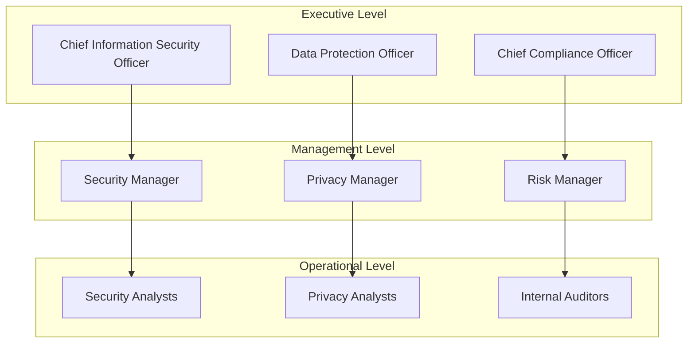
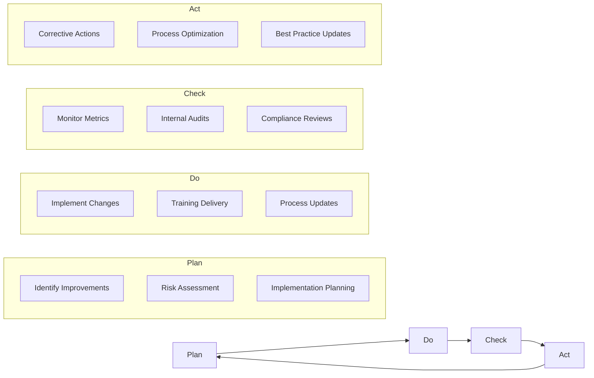

# Compliance Framework

This document outlines the comprehensive compliance framework for the SaaS template, designed to meet Fortune 500 enterprise requirements and regulatory standards.

## Framework Overview

The compliance framework provides a structured approach to meeting regulatory requirements, industry standards, and enterprise policies. It encompasses data protection, security controls, audit requirements, and continuous compliance monitoring.

### Compliance Objectives
- **Regulatory Compliance**: Meet all applicable legal and regulatory requirements
- **Risk Management**: Identify, assess, and mitigate compliance risks
- **Continuous Monitoring**: Ongoing compliance assessment and improvement
- **Documentation**: Comprehensive compliance documentation and evidence
- **Training**: Staff awareness and compliance training programs
- **Audit Readiness**: Prepare for internal and external audits

## Regulatory Landscape

### Data Protection Regulations

#### GDPR (General Data Protection Regulation)
**Scope**: All personal data of EU residents
**Key Requirements**:
- Lawful basis for processing personal data
- Data subject rights (access, portability, deletion)
- Privacy by design and by default
- Data Protection Impact Assessments (DPIA)
- Breach notification within 72 hours
- Data Protection Officer (DPO) appointment

**Implementation Status**:
- ✅ Privacy policy and consent management
- ✅ Data subject access request process
- ✅ Right to be forgotten implementation
- ✅ Data portability features
- ✅ Privacy-enhancing technologies
- ✅ Breach detection and notification system

#### CCPA (California Consumer Privacy Act)
**Scope**: Personal information of California residents
**Key Requirements**:
- Right to know about data collection
- Right to delete personal information
- Right to opt-out of data sales
- Non-discrimination for privacy rights exercise

**Implementation Status**:
- ✅ Consumer privacy rights portal
- ✅ Data inventory and mapping
- ✅ Opt-out mechanisms
- ✅ Privacy disclosures

### Industry-Specific Regulations

#### HIPAA (Health Insurance Portability and Accountability Act)
**Scope**: Protected Health Information (PHI) - if applicable
**Key Requirements**:
- Administrative safeguards
- Physical safeguards
- Technical safeguards
- Business Associate Agreements (BAA)

#### PCI DSS (Payment Card Industry Data Security Standard)
**Scope**: Credit card data processing and storage
**Key Requirements**:
- Network security controls
- Cardholder data protection
- Vulnerability management
- Access control measures
- Security monitoring

**Implementation Status**:
- ✅ Network segmentation
- ✅ Encryption of cardholder data
- ✅ Secure payment processing (Stripe)
- ✅ Regular security testing
- ✅ Access control implementation

## Security Frameworks and Standards

### SOC 2 (Service Organization Control 2)

#### Trust Service Criteria

**Security**
- Controls to protect system resources against unauthorized access
- Implementation: Multi-factor authentication, access controls, encryption

**Availability**
- System availability for operation and use as committed or agreed
- Implementation: Monitoring, incident response, disaster recovery

**Processing Integrity**
- System processing is complete, valid, accurate, timely, and authorized
- Implementation: Input validation, error handling, audit trails

**Confidentiality**
- Information designated as confidential is protected
- Implementation: Data classification, encryption, access controls

**Privacy**
- Personal information is collected, used, retained, disclosed, and disposed of in conformity with commitments
- Implementation: Privacy controls, consent management, data governance

#### SOC 2 Compliance Checklist

**Organizational Controls**
- [ ] Information security policy documented and approved
- [ ] Risk management program established
- [ ] Security awareness training program
- [ ] Incident response procedures documented
- [ ] Vendor management program

**Access Controls**
- [ ] User access provisioning and deprovisioning procedures
- [ ] Multi-factor authentication implementation
- [ ] Privileged access management
- [ ] Regular access reviews and certifications
- [ ] Segregation of duties implementation

**System Operations**
- [ ] Change management procedures
- [ ] System monitoring and logging
- [ ] Vulnerability management program
- [ ] Configuration management
- [ ] Data backup and recovery procedures

### ISO 27001 (Information Security Management System)

#### Control Objectives
1. **Information Security Policies** (A.5)
2. **Organization of Information Security** (A.6)
3. **Human Resource Security** (A.7)
4. **Asset Management** (A.8)
5. **Access Control** (A.9)
6. **Cryptography** (A.10)
7. **Physical and Environmental Security** (A.11)
8. **Operations Security** (A.12)
9. **Communications Security** (A.13)
10. **System Acquisition, Development, and Maintenance** (A.14)
11. **Supplier Relationships** (A.15)
12. **Information Security Incident Management** (A.16)
13. **Information Security Aspects of Business Continuity Management** (A.17)
14. **Compliance** (A.18)

#### Implementation Roadmap

**Phase 1: Foundation (0-3 months)**
- Information security policy development
- Risk assessment methodology
- Asset inventory and classification
- Access control implementation

**Phase 2: Implementation (3-9 months)**
- Security control implementation
- Incident response procedures
- Business continuity planning
- Vendor security assessments

**Phase 3: Certification (9-12 months)**
- Internal audit program
- Management review process
- External certification audit
- Continuous improvement program

## Compliance Management System

### Governance Structure



### Roles and Responsibilities

#### Chief Information Security Officer (CISO)
- Overall security strategy and governance
- Security risk management oversight
- Compliance program leadership
- Security incident escalation

#### Data Protection Officer (DPO)
- Privacy compliance oversight
- Data protection impact assessments
- Data subject rights management
- Privacy breach management

#### Compliance Manager
- Compliance program management
- Regulatory change monitoring
- Audit coordination
- Compliance training oversight

## Risk Assessment and Management

### Compliance Risk Assessment Matrix

| Risk Category | Likelihood | Impact | Risk Score | Mitigation Strategy |
|---------------|------------|--------|------------|-------------------|
| Data Breach | Medium | High | 8 | Encryption, access controls, monitoring |
| Regulatory Fine | Low | High | 6 | Compliance monitoring, legal review |
| System Outage | Medium | Medium | 6 | Redundancy, disaster recovery |
| Insider Threat | Low | Medium | 4 | Access controls, monitoring, training |
| Third-party Risk | Medium | Medium | 6 | Vendor assessments, contracts |

### Risk Treatment Plans

#### High-Risk Items (Score 8-9)
- **Data Breach Prevention**: Implement comprehensive security controls
- **Privacy Compliance**: Deploy privacy management platform
- **Incident Response**: Establish 24/7 security operations center

#### Medium-Risk Items (Score 6-7)
- **Vendor Management**: Implement third-party risk assessment program
- **Business Continuity**: Develop comprehensive disaster recovery plan
- **Compliance Monitoring**: Deploy automated compliance monitoring tools

#### Low-Risk Items (Score 1-5)
- **Policy Updates**: Regular policy review and update cycle
- **Training Programs**: Ongoing security and privacy awareness training
- **Process Improvements**: Continuous process optimization

## Compliance Monitoring and Measurement

### Key Performance Indicators (KPIs)

| KPI | Target | Current | Status |
|-----|--------|---------|---------|
| Compliance Audit Score | > 95% | 92% | 🟡 In Progress |
| Data Subject Response Time | < 30 days | 15 days | ✅ Compliant |
| Security Incident Response | < 1 hour | 45 minutes | ✅ Compliant |
| Employee Training Completion | 100% | 85% | 🟡 In Progress |
| Vulnerability Remediation | < 30 days | 22 days | ✅ Compliant |
| Privacy Impact Assessments | 100% coverage | 80% | 🟡 In Progress |

### Compliance Dashboard Metrics

```yaml
security_metrics:
  - name: "Security Incidents"
    current: 2
    target: "< 5"
    trend: "decreasing"

  - name: "Vulnerability Remediation Time"
    current: "22 days"
    target: "< 30 days"
    trend: "stable"

privacy_metrics:
  - name: "Data Subject Requests"
    current: 45
    target: "< 100"
    trend: "increasing"

  - name: "Privacy Assessment Coverage"
    current: "80%"
    target: "100%"
    trend: "increasing"

compliance_metrics:
  - name: "Policy Compliance Rate"
    current: "92%"
    target: "> 95%"
    trend: "improving"

  - name: "Training Completion Rate"
    current: "85%"
    target: "100%"
    trend: "improving"
```

## Audit Management

### Internal Audit Program

#### Audit Schedule
- **Quarterly**: High-risk areas and critical controls
- **Semi-annually**: Medium-risk areas
- **Annually**: Complete compliance framework review

#### Audit Scope Areas
1. **Data Protection**: GDPR, CCPA compliance
2. **Security Controls**: SOC 2, ISO 27001 controls
3. **Payment Security**: PCI DSS compliance
4. **Access Management**: User access and privileges
5. **Incident Response**: Security and privacy incidents
6. **Vendor Management**: Third-party risk assessments

### External Audit Preparation

#### Pre-Audit Checklist
- [ ] Evidence collection and organization
- [ ] Documentation review and updates
- [ ] Staff interview preparation
- [ ] System access provisioning for auditors
- [ ] Audit room setup and logistics
- [ ] Stakeholder communication plan

#### Audit Evidence Repository
```
/compliance/evidence/
├── policies-and-procedures/
├── risk-assessments/
├── training-records/
├── incident-reports/
├── vulnerability-assessments/
├── access-reviews/
├── vendor-assessments/
└── remediation-tracking/
```

## Training and Awareness

### Compliance Training Program

#### Role-Based Training Matrix

| Role | Security Training | Privacy Training | Compliance Training | Frequency |
|------|------------------|------------------|-------------------|-----------|
| All Employees | General Security Awareness | Privacy Fundamentals | Code of Conduct | Annual |
| Developers | Secure Coding | Privacy by Design | Development Standards | Quarterly |
| IT Staff | Advanced Security | Data Handling | Technical Controls | Semi-annual |
| Management | Risk Management | Privacy Governance | Compliance Oversight | Annual |

#### Training Content

**Security Awareness Training**
- Password security and MFA
- Phishing recognition and reporting
- Social engineering awareness
- Incident reporting procedures
- Data classification and handling

**Privacy Training**
- Personal data identification
- Lawful basis for processing
- Data subject rights
- Privacy impact assessments
- Breach notification procedures

**Compliance Training**
- Regulatory requirements overview
- Policy and procedure adherence
- Documentation requirements
- Audit preparation and participation
- Continuous improvement processes

## Documentation Management

### Compliance Documentation Structure

```
/compliance-docs/
├── policies/
│   ├── information-security-policy.md
│   ├── privacy-policy.md
│   ├── incident-response-policy.md
│   └── vendor-management-policy.md
├── procedures/
│   ├── access-management-procedures.md
│   ├── data-breach-procedures.md
│   ├── vulnerability-management-procedures.md
│   └── audit-procedures.md
├── standards/
│   ├── encryption-standards.md
│   ├── access-control-standards.md
│   └── development-standards.md
├── assessments/
│   ├── privacy-impact-assessments/
│   ├── risk-assessments/
│   └── vendor-assessments/
└── evidence/
    ├── audit-reports/
    ├── compliance-certifications/
    ├── training-records/
    └── incident-documentation/
```

### Document Version Control

#### Document Lifecycle
1. **Draft**: Initial document creation
2. **Review**: Stakeholder review and approval
3. **Approved**: Management approval and publication
4. **Active**: Current operational document
5. **Superseded**: Replaced by newer version
6. **Archived**: Retained for historical purposes

#### Version Control Standards
- **Version Format**: v1.0, v1.1 (minor), v2.0 (major)
- **Review Frequency**: Annual or triggered by regulatory changes
- **Approval Process**: Department head and compliance officer approval
- **Distribution**: Controlled distribution to relevant stakeholders

## Regulatory Change Management

### Change Monitoring Process

1. **Regulatory Intelligence**: Monitor regulatory bodies and industry publications
2. **Impact Assessment**: Evaluate impact on current compliance posture
3. **Gap Analysis**: Identify compliance gaps and requirements
4. **Implementation Planning**: Develop implementation roadmap
5. **Stakeholder Communication**: Communicate changes to relevant teams
6. **Implementation**: Execute compliance updates
7. **Validation**: Verify compliance with new requirements

### Regulatory Sources

#### Data Protection
- **EU**: European Data Protection Board (EDPB) guidance
- **US**: State privacy law developments
- **Global**: International data transfer regulations

#### Security Standards
- **ISO**: ISO/IEC 27001 updates
- **NIST**: Cybersecurity Framework updates
- **Industry**: Sector-specific security guidance

#### Industry Regulations
- **Financial Services**: Banking and financial regulations
- **Healthcare**: HIPAA and health information security
- **Technology**: Cloud computing and data processing regulations

## Continuous Improvement

### Improvement Cycle



### Improvement Sources
- **Internal Audits**: Findings and recommendations
- **External Audits**: Third-party assessment results
- **Incident Analysis**: Lessons learned from incidents
- **Regulatory Changes**: New compliance requirements
- **Industry Best Practices**: Peer benchmarking and standards

### Metrics-Driven Improvement
- **Trend Analysis**: Identify patterns in compliance metrics
- **Root Cause Analysis**: Address underlying compliance issues
- **Benchmarking**: Compare against industry standards
- **Cost-Benefit Analysis**: Optimize compliance investments

---

*This compliance framework provides comprehensive guidance for meeting enterprise regulatory requirements and maintaining ongoing compliance in the SaaS template environment.*